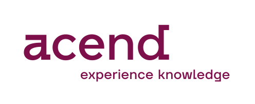

Follow us  

We offer Cloud Native training with experts who use these technologies every day. Trainings with a unique experience and a lot of handson.

## About us

It is our shared ambition to revolutionize the world of IT training.

What has happened so far: the idea of acend was initially formulated at a Sammy Deluxe concert in 2019. This was the moment when some of the founders agreed to pursue their vision of revolutionizing IT training. The rest is history. Today, we provide educational, entertaining and rewarding training experiences you won’t forget!

## Our Mission

As a knowledge platform, acend accompanies engineers and their businesses across new technological frontiers. We offer extraordinary, inspiring and practice-oriented teaching and learning experiences. Together with high-powered partners like Puzzle ITC, we draw on our expertise in the development, support and teaching of Cloud Native and Open Source technologies. Our trainings focus on the exchange of knowledge and shared learning – practice-oriented, uncomplicated and direct.

## Blazing New Trails

We present knowledge in a surprising and interactive fashion. Our trainings consist of varied approaches to theory and practice-based labs.

## Taught by Pioneers

Our trainers are experts in their field, continue to develop their skills with an ardent thirst for knowledge and put their heart and soul into their trainings.

## Become Part of the Community

We see ourselves as part of the growing Swiss Cloud Native community and invite you to join in. For this reason, we emphasize knowledge exchange during and after our trainings.
